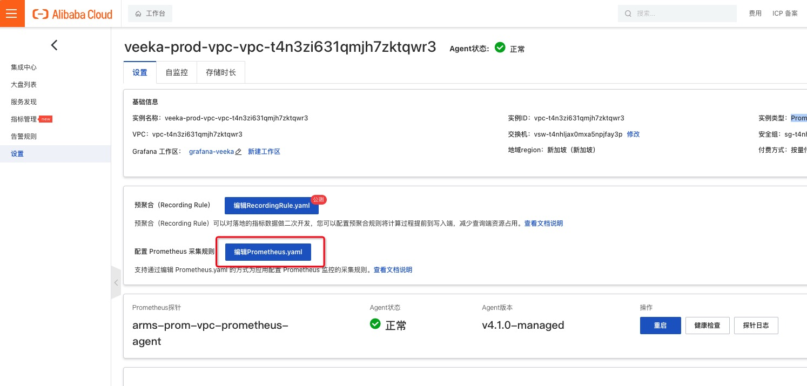
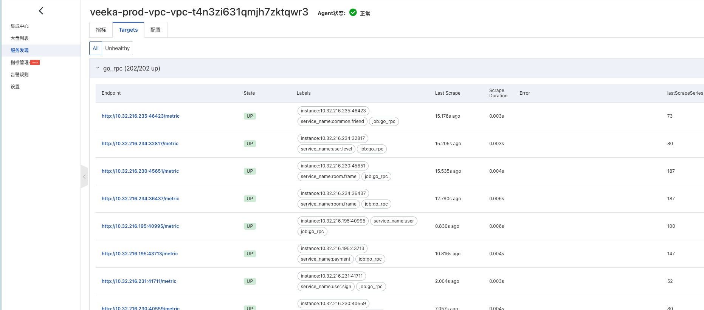
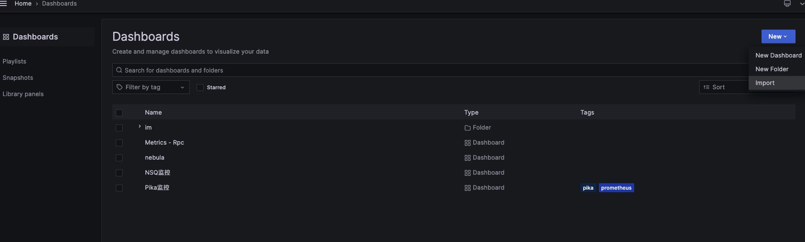
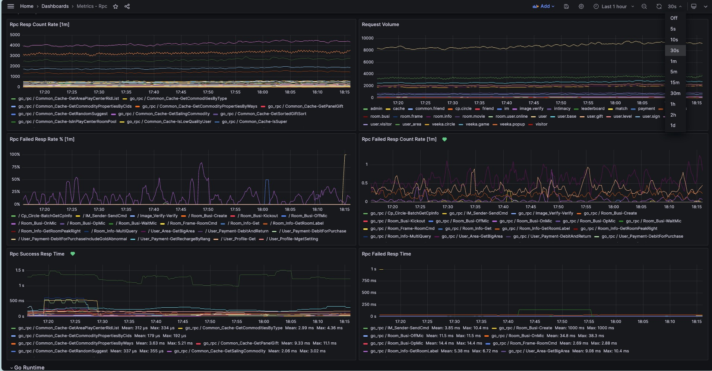
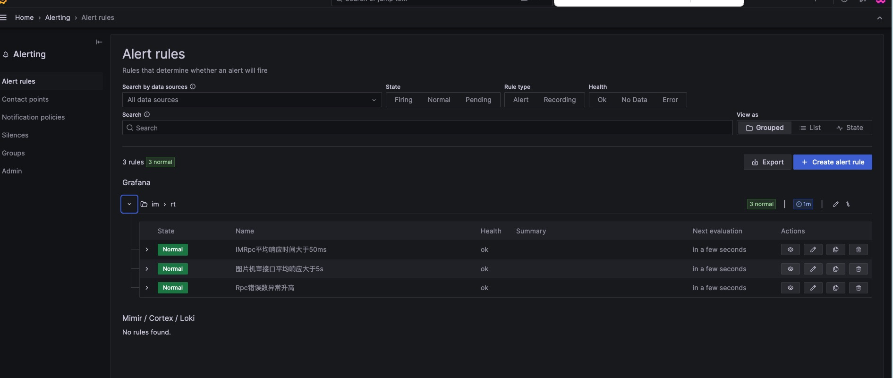

# rpc_metrics

## 背景
RPC 服务缺乏基于服务的监控，对服务的QPS、错误率、响应时间等一无所知 ，也不方便排查问题，rpc_metrics应运而生， 可以自动采集 rpcx 服务的请求指标，支持服务发现（Consul），支持 Prometheus + Grafana 监控告警集成，易于集成，易于使用。


## 快速开始

### 安装 

```aiignore
go install github.com/olachat/rpcx_metrics@v1.0.0
```

### 使用
在go_frame工程  library/rpc/rpc.go文件中的
```aiignore
    rpcServer.Plugins.Add(serverplugin.OpenTracingPlugin{})
```
下面添加：
```aiignore
   rpcServer.Plugins.Add(prom.NewPrometheusPlugin())
```
编译重启所有RPC服务

### Prometheus 配置
打开阿里云Prometheus设置页

点击修改prometheus.yaml，添加，修改其中consul的地址
```aiignore
global:
scrape_interval: 15s
evaluation_interval: 15s
scrape_configs:
  - job_name: go_rpc
    honor_timestamps: false
    honor_labels: false
    scheme: http
    metrics_path: metric
    consul_sd_configs:
      - server: 10.32.216.243:8500
        services:
          - go_rpc_exporter
    relabel_configs:
      - regex: (.*)
        action: replace
        source_labels:
          - __meta_consul_service_metadata_service_name
        separator: ;
        target_label: service_name
```
点击重启
配置完成，打开服务发现->Targets，可以看到所有的rpc服务都出现了，如下界面


## Grafana监控指标配置
打开阿里云grafana，点击右上角New，点击import

导入路径grafana/demo.json 得到如下看板

- API 调用统计
- Service 调用统计
- 失败率 失败计数
- 成功/失败 响应时间



可以按照自己的需要新增告警规则
